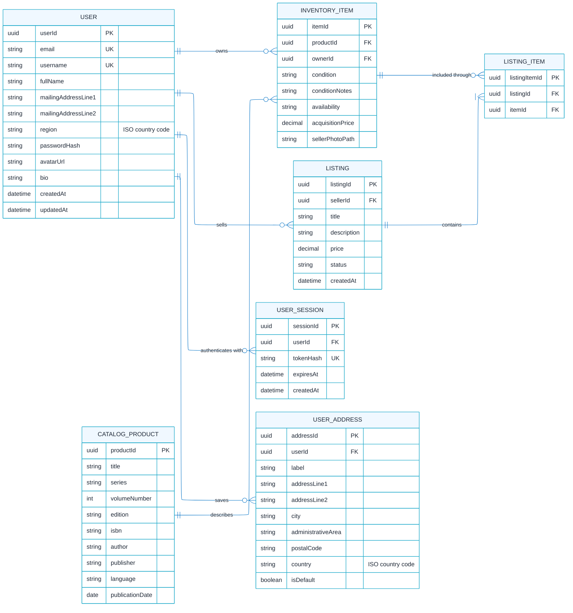

# build-backend-foundation

Project has three phases:

1. Build the domain and database foundation
2. Implement the local REST API
3. Build the Supabase backend deployment

The image-storage schema and Supabase deployment design are documented in
[`docs/media-storage-design.md`](docs/media-storage-design.md). The design
covers catalog product images, inventory item images, listing item images, and
user avatars without storing duplicate image bytes in PostgreSQL.

## Phase 1

### Step 1 - Core Database Domain Model / Business Logic

The Manga Marketplace database separates catalog products, seller-owned inventory items, and marketplace listings into distinct tables. This structure ensures that general manga information, individual physical copies, and sales offers can each be managed independently while remaining connected through defined relationships. This is how the marketplace’s core domain is defined.

#### ERD

`Catalog Product --> Inventory Item --> Listing Item --> Listing(s)`



### Step 2 - Define Database Entities

## Seed data

With the database environment variables configured, populate the local
database with deterministic development records:

```bash
npm run seed
```

The seed is safe to rerun: it updates the records associated with its stable
UUIDs and does not delete unrelated data. It creates catalog products,
seller-owned inventory in several availability states, active listings, a sold
listing, and their listing-item relationships. The seeded users match the owner
and seller UUIDs referenced by the inventory and listing records.

To completely erase, recreate, and reseed the local development database:

```bash
npm run seed-reset
```

`seed-reset` is destructive. It refuses to run in production, against a remote
database host, or against a database name other than `manga_marketplace` or a
name ending in `_test`.

## User signup

Create a user and a 30-day session with `POST /users`:

```json
{
  "fullName": "Mika Reader",
  "mailingAddressLine1": "123 Manga Lane",
  "mailingAddressLine2": "Apartment 4B",
  "region": "US",
  "username": "mikashelf",
  "email": "mika@example.com",
  "password": "Volume#123"
}
```

Passwords are salted and hashed with `scrypt`. The API returns the raw session
token once; only its SHA-256 hash is stored in `user_sessions`. The frontend
keeps the returned token in an HTTP-only, same-site cookie.

## Authenticated account API

Authenticated requests use `Authorization: Bearer <session-token>`.

- `GET /users/me` returns the signed-in profile and saved addresses.
- `PATCH /users/me` updates the name, username, region, or avatar URL.
- `PATCH /users/me/bio` updates the profile bio.
- `POST /users/me/addresses` adds an address.
- `PATCH /users/me/addresses/:addressId` updates an owned address.
- `DELETE /users/me/addresses/:addressId` removes an owned address.
- `DELETE /users/me/session` signs out the current session.
- `DELETE /users/me` deletes the account and its associated marketplace data.
