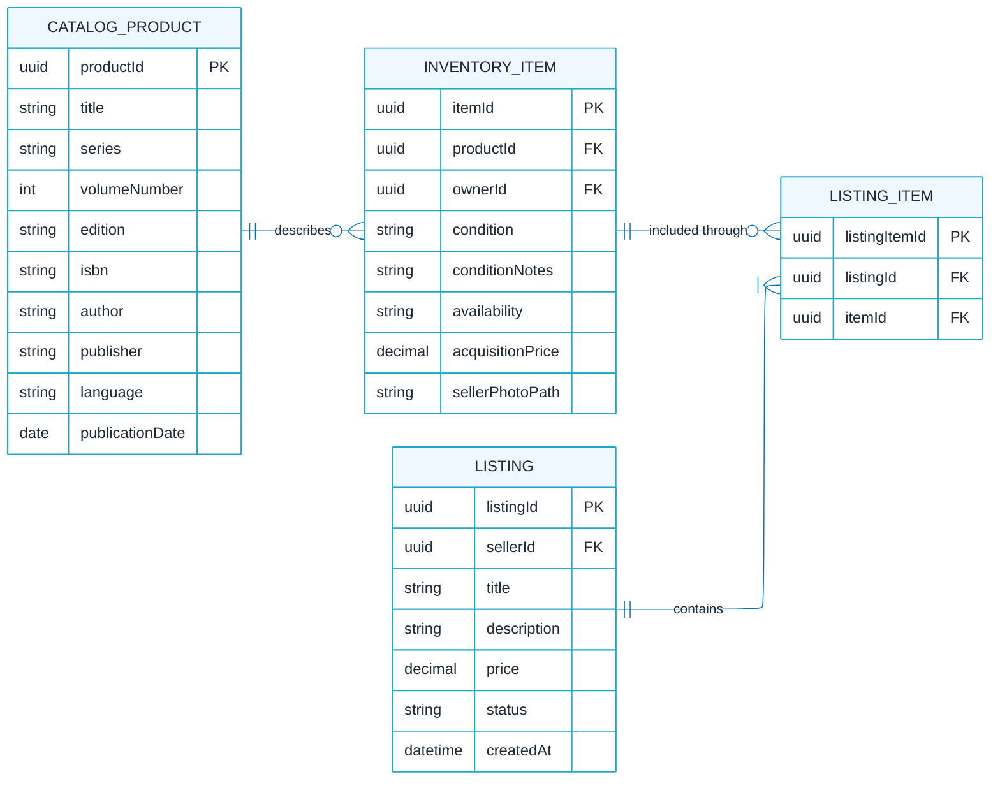

# build-backend-foundation
The Manga Marketplace database separates catalog products, seller-owned inventory items, and marketplace listings into distinct tables. This structure ensures that general manga information, individual physical copies, and sales offers can each be managed independently while remaining connected through defined relationships. This is how the marketplace’s core domain is defined.

## Manga Marketplace Core Domain ERD

