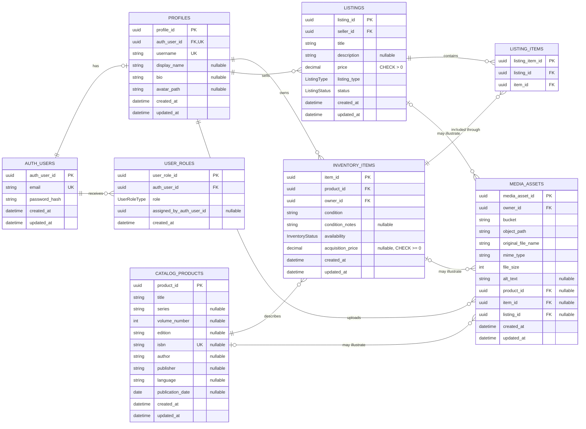

# build-backend-foundation
Project has three phases: 
1) Build the domain and database foundation
2) Implement the local REST API
3) Build the Supabase backend deployment

## Phase 1
### Manga Marketplace Core Domain ERD
This ERD reflects all entities and relationships defined by the Prisma schema and migrations in this phase. Nullable columns are marked in the attribute descriptions.

Enum values:

- `UserRoleType`: `USER`, `DEVELOPER`, `ADMIN`
- `InventoryStatus`: `AVAILABLE`, `RESERVED`, `SOLD`, `REMOVED`
- `ListingType`: `SINGLE`, `BUNDLE`
- `ListingStatus`: `DRAFT`, `ACTIVE`, `RESERVED`, `SOLD`, `CANCELLED`, `ARCHIVED`

The schema also enforces composite uniqueness for `(auth_user_id, role)` on `USER_ROLES` and `(listing_id, item_id)` on `LISTING_ITEMS`.
